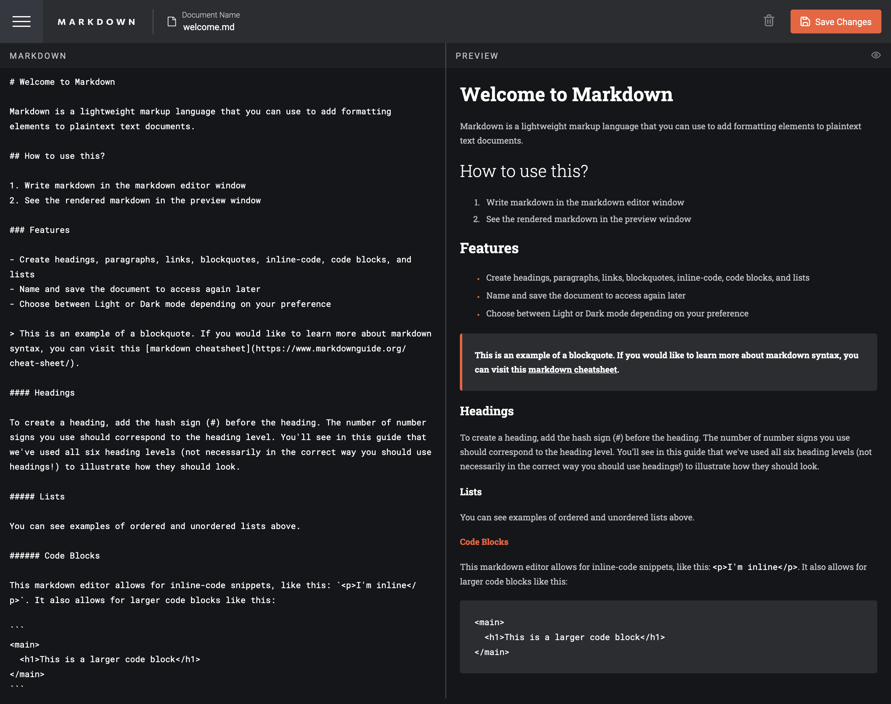

# Frontend Mentor - In-browser markdown editor solution

This is a solution to the [In-browser markdown editor challenge on Frontend Mentor](https://www.frontendmentor.io/challenges/inbrowser-markdown-editor-r16TrrQX9). Frontend Mentor challenges help you improve your coding skills by building realistic projects. 

## Table of contents

- [Overview](#overview)
  - [The challenge](#the-challenge)
  - [Screenshot](#screenshot)
  - [Links](#links)
- [My process](#my-process)
  - [Built with](#built-with)
  - [What I learned](#what-i-learned)
  - [Continued development](#continued-development)
  - [Useful resources](#useful-resources)
- [Author](#author)
- [Acknowledgments](#acknowledgments)

**Note: Delete this note and update the table of contents based on what sections you keep.**

## Overview

### The challenge

Users should be able to:

- Create, Read, Update, and Delete markdown documents
- Name and save documents to be accessed as needed
- Edit the markdown of a document and see the formatted preview of the content
- View a full-page preview of the formatted content
- View the optimal layout for the app depending on their device's screen size
- See hover states for all interactive elements on the page
- **Bonus**: If you're building a purely front-end project, use localStorage to save the current state in the browser that persists when the browser is refreshed
- **Bonus**: Build this project as a full-stack application

### Screenshot

### Links

- Solution URL: [Add solution URL here](https://your-solution-url.com)
- Live Site URL: [Add live site URL here](https://your-live-site-url.com)

## My process

### Built with

- Semantic HTML5 markup
- Native CSS
- Vanilla JavaScript
- Mobile-first workflow
- [Marked](https://marked.js.org/) - Markdown compiler
- [DOMPurify](https://github.com/cure53/DOMPurify) - to sanitize the output
- localStorage to save the current state in the browser that persists when the browser is refreshed
- JSON to populate the initial welcome document
- Light / Dark theme switch
- Chrome Screen reader - for accessibility check
- Chrome Lighthouse
- PerfectPixel

### Useful resources

- [What is CRUD](https://www.codecademy.com/article/what-is-crud)
- [Budibase CRUD](https://budibase.com/blog/crud-app/) - as option for fullstack variant
- [Local storage](https://medium.com/@garadiya0/the-only-article-youll-need-to-work-with-local-storage-in-javascript-f33d4a1c84e) - For the purpose of this challange, I used localStorage to store user data.
- [Markdown Editor with Marked](https://daext.com/blog/how-to-create-a-markdown-editor-with-javascript/)
- [Marked Parser](https://github.com/markedjs/marked)
- [DOMPurify](https://github.com/cure53/DOMPurify) - to sanitize the output

## Author

- OrtalyARTS Portfolio Website - [@ortalyARTS.com](https://ortaly.com/)
- Frontend Mentor - [@ortalyARTS](https://www.frontendmentor.io/profile/ortalyARTS)
- Linkedin - [@ortalyARTS](www.linkedin.com/in/ortalyarts) 
